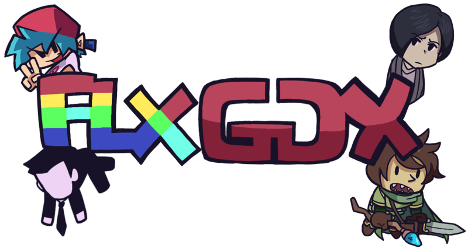

<div align="center">
  

  # FlixelGDX
    
  **Logo Artist: [LeoThM](https://www.instagram.com/leoxthm_/)**

  [](https://github.com/flixelgdx/flixelgdx/actions/workflows/ci_build.yml)
  [](https://central.sonatype.com/artifact/org.flixelgdx/flixelgdx-core)
  [](https://jitpack.io/#flixelgdx/flixelgdx)
  [](https://opensource.org/licenses/MIT)
  [](https://flixelgdx.org)
  [](https://github.com/flixelgdx/flixelgdx/stargazers)
  [](https://adoptium.net/temurin/releases?version=17&os=any&arch=any)
  [](https://flixelgdx.org)

  FlixelGDX is a simplistic, extensible game framework for the Java ecosystem, with heavy inspiration from
  [HaxeFlixel](https://haxeflixel.com/) and the original ActionScript [Flixel](http://www.flixel.org/). It's designed
  to bring the classic style of it's Haxe-based cousin, with heavy improvements of its architecture, primarily
  focusing on simplicity, extensibility and performance.
  
  If you like Java (or Kotlin), and you want a simpler alternative, read on.
</div>

> [!NOTE]
> FlixelGDX is an independent project and is not officially affiliated with HaxeFlixel.

> [!IMPORTANT]
> FlixelGDX is still relatively new and currently supports desktop and HTML5. Mobile support is coming soon!

---

## Features

FlixelGDX is packed with a comprehensive toolset, ranging from simple utility classes to multiple plugins — all made 
with developer experience in mind.

### State Management

The framework provides the iconic simple state-based architecture that every veteran knows and loves:

```java
public class PlayState extends FlixelState {
  private FlixelSprite player;
  
  @Override
  public void create() {
    player = new FlixelSprite();
    player.loadGraphic(Flixel.files.internal("player.png"));
    player.screenCenter();
    add(player);
  }
  
  @Override
  public void update(float elapsed) {
    float speed = 500f * elapsed;
    if (Flixel.keys.pressed(FlixelKey.LEFT)) {
      player.changeX(-speed);
    }
    if (Flixel.keys.pressed(FlixelKey.RIGHT)) {
      player.changeX(speed);
    }
    // So on...
  }
}
```

### Animations

The framework contains a wide set of animation utilities for Sparrow spritesheets and Adobe Animate rig atlases — including
out-of-the-box support for the Better Texture Atlas extension:

```java
// A simple sparrow atlas being loaded and parsed automatically.
FlixelSprite sparrow = new FlixelSprite();
sparrow.ensureAnimation();
sparrow.animation.addSparrowAtlas(Flixel.files.internal("sparrow-folder"));
sparrow.animation.addByPrefix("walk", "PLAYER WALKING0", 24, false);
sparrow.animation.play("walk");

// An Adobe Animate rig sprite. Note how a Sparrow can also be mixed with it as well. 
FlixelAnimateSprite atlas = new FlixelAnimateSprite();
atlas.addSpritemapAndAnimation(Flixel.files.internal("atlas-folder"));
atlas.animation.addSparrowAtlas(Flixel.files.internal("sparrow-folder"));
atlas.animation.play("jump");  // Play an animation from the rig just like how you would for Sparrows.
```

If you want more advanced control, you can also set a finite state machine:

```java
// After loading frames and registering clips on the sprite:
var fsm = new FlixelAnimationStateMachine(player);
fsm.addState("idle", "idle").allowTo("run", "attack");
fsm.addState("run", "run").allowTo("idle", "attack");
fsm.addState("attack", "attack")
   .autoAdvanceTo("idle)
   .onEnter(() -> sword.swing());
fsm.setState("idle");

// Add it to a controller so it's ticked automatically:
player.animation.setStateMachine(fsm);

// In your game code:
if (attackPressed){
  fsm.setState("attack");
} else if (speed > 0.1f) {
  fsm.setState("run");
} else {
  fsm.setState("idle");
}
```

### Tweening

FlixelGDX provides a very flexible and simple yet robust tweening engine:

```java
// Slide a sprite to x=500, y=300 over 1.5 seconds with a bounce-out ease.
FlixelTween.tween(player, new FlixelTweenSettings()
  .addGoal(player::getX, 500f, player::setX)
  .addGoal(player::getY, 300f, player::setY)
  .setDuration(1.5f)
  .setEase(FlixelEase::bounceOut));
```

Or in Kotlin with the framework's first party extension:

```kotlin
// The tween(...) method is automatically applied to every object.
player.tween(duration = 1.5f, ease = FlixelEase::bounceOut) {
  goal(player::getX, 500f, player::setX)
  goal(player::getY, 300f, player::setY)
}
```

### Plugins and Extensions

The framework contains many first-party plugins and extensions to automate all the tedious grunt work — allowing you to 
focus on what's important: making a game.

The key stars of the show are:

#### Shader Plugin

Since FlixelGDX's native platforms (primarily desktop and mobile) are built on [bgfx](https://github.com/bkaradzic/bgfx),
that usually means handling shaders would be a nightmare: download bgfx's source code and its required dependencies,
wait forever until it compiles, write different shaders for each graphics API, etc.

Not here. The framework's `org.flixelgdx.shader` plugin pre-bundles the `shaderc` binary for every platform, and
cross-compiles a single GLSL shader into every `.bin` shader file for each graphics API:

```groovy
plugins {
  id 'java'
  id 'org.flixelgdx.shaders' version '<flixel-version>'
}

flixelShaders {
  // Where the .glsl sources live (default: src/main/shaders).
  sourceDir = file('src/main/shaders')

  shader('grayscale') {
    fragment = 'grayscale.frag.glsl'
  }

  shader('wave') {
    fragment = 'wave.frag.glsl'
    vertex = 'wave.vert.glsl'   // optional
  }
}
```

Then inside a game:

```java
FlixelShader grayscale = FlixelShaders.load("grayscale");
FlixelShader wave = FlixelShaders.load("wave");

sprite.setShader(grayscale);
camera.setShader(wave);
```

---

## Getting Started

If you want to start using the framework, you don't need to worry about configuring anything too crazy — the framework's 
already got you covered. You can get started right way with the following links:

- [🔧 Project Generator](https://flixelgdx.org/getting-started)
- [📖 Docs](https://flixelgdx.org/docs)
- [⚙️ API Pages](https://flixelgdx.org/api)

---

## Project navigation

- **[Contributing Guide](CONTRIBUTING.md)**: Coding standards, PR requirements, and how to contribute.
- **[Project Structure](ARCHITECTURE.md)**: The multi-module layout and how Gradle is used.
- **[Compiling & Testing](COMPILING.md)**: How to build the framework and test it as a dependency in your own projects.
- **[Code of Conduct](CODE_OF_CONDUCT.md)**: Rules set in place for a stable open source community.
- **[Project Roles](GOVERNANCE.md)**: How each role for the project operates, including project leaders and maintainers.
